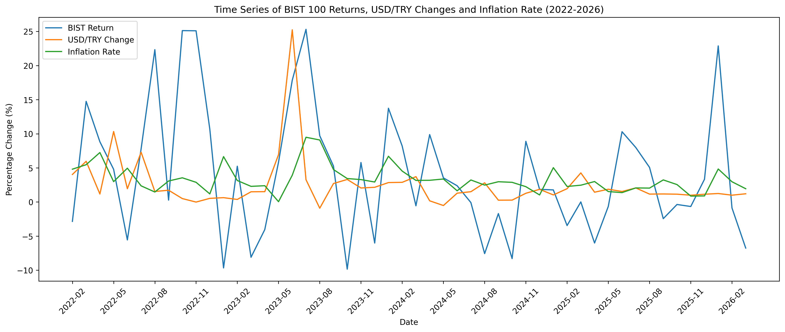
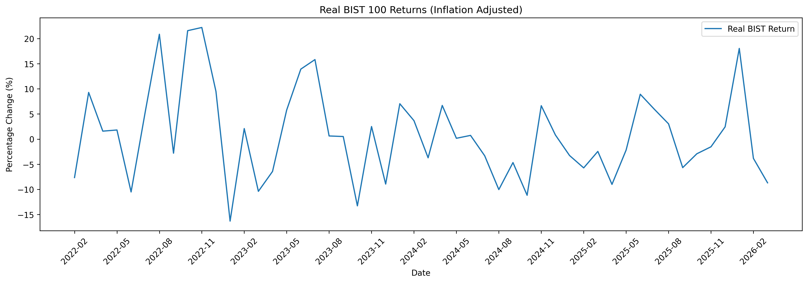
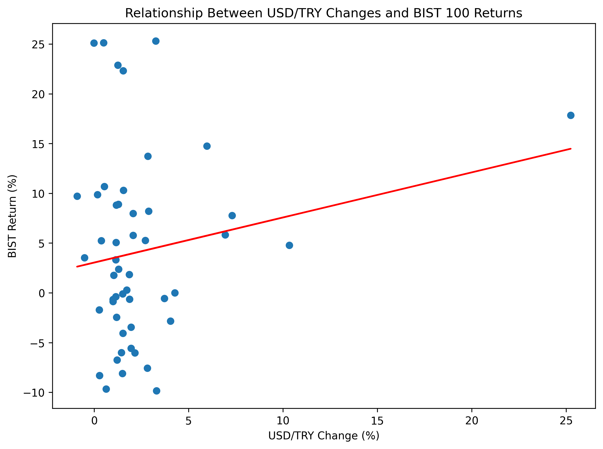

# BIST 100, USD/TRY and Inflation Analysis
Analysis of BIST 100, USD/TRY and inflation using Python (pandas, numpy, matplotlib)

This project explores the relationship between BIST 100 returns, USD/TRY exchange rate changes, and inflation in Türkiye.

## Data
- Monthly data (2022–2026)
- BIST 100 index
- USD/TRY exchange rate
- CPI (inflation)

## What I did
- Cleaned and prepared raw datasets
- Merged data from different sources
- Calculated monthly returns
- Compared nominal and real (inflation-adjusted) returns
- Visualized the results using matplotlib
- Added a simple regression line to observe the general relationship between variables

## Key Observations
- BIST 100 returns vary more than inflation
- Inflation reduces real returns
- The relationship between exchange rate changes and stock returns appears weak

## Tools
- Python (pandas, numpy, matplotlib)

## Data Sources
- Public financial data platforms
- EVDS (Central Bank of the Republic of Türkiye)

## Example Output

### Time Series

### Real Returns

### Scatter Plot

